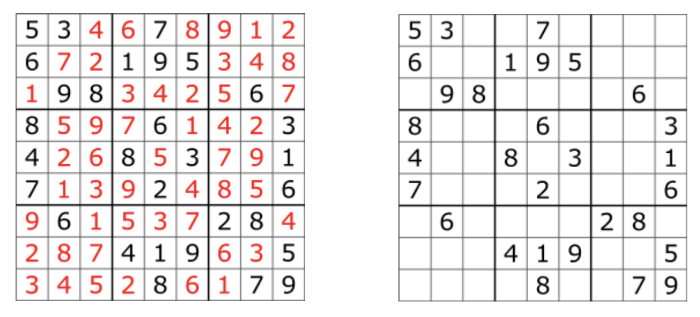
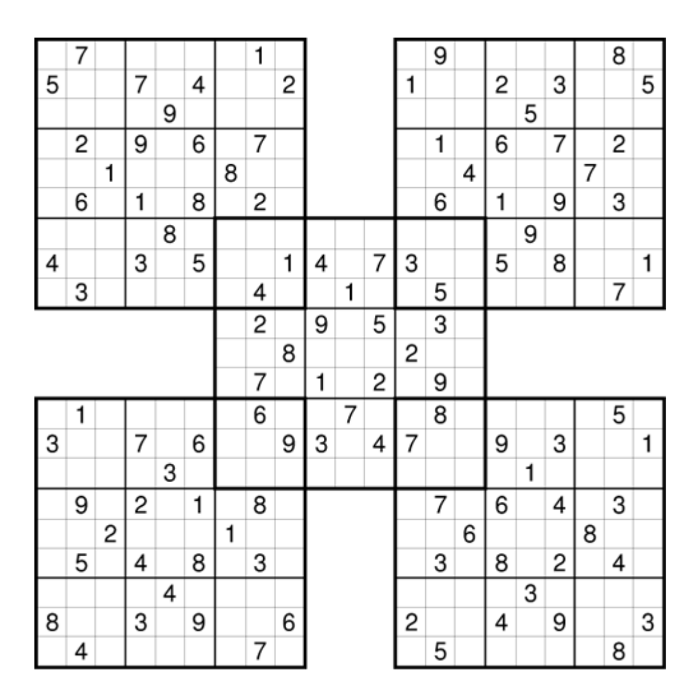

# Sudoku

Sudoku is a logic-based, combinatorial number-placement puzzle. The objective is to fill a 9×9 grid with digits so that each column, each row, and each of the nine 3×3 subgrids that compose the grid (also called boxes, blocks, or regions) contain all of the digits from 1 to 9. The puzzle setter provides a partially completed grid, which for a well-posed puzzle has a single solution. A typical sudoko puzzel and its solution are shown below.

The multiple sudoku consists of overlapping several sudoku grids. Like the normal sudoku each 9×9 grid must be filled as before, but some parts are shared between the two grids and these common parts must be filled while no law is broken in two grids.

